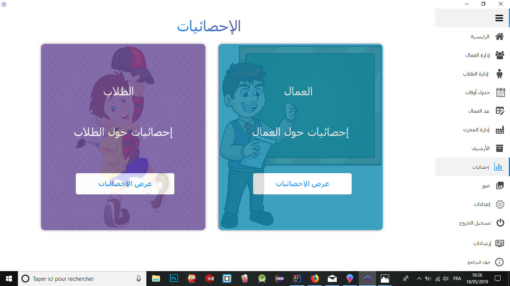
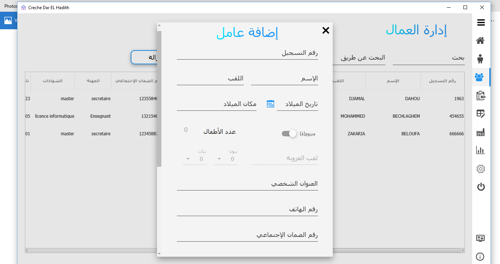
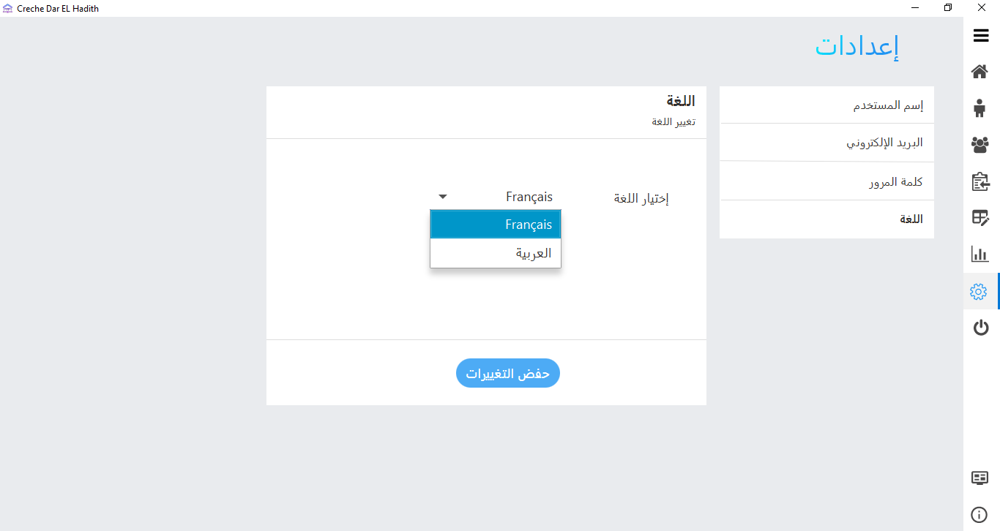
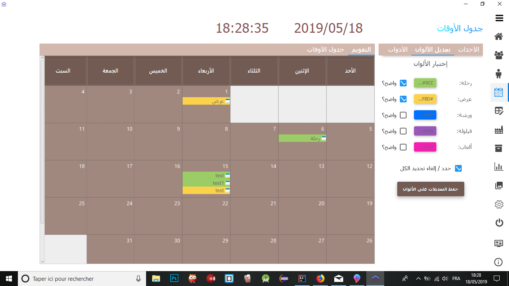

# Creche_Dar_Elhadith

This is a work in  progress. will update the README.md when done.

### Voici quelque screenshots :
<p align="center">
  
  
  
  
  
  
</p>

## Getting Started

These instructions will get you a copy of the project up and running on your local machine for development and testing purposes. See deployment for notes on how to deploy the project on a live system.

### Prerequisites

What things you need to install the software and how to install them

```
Give examples
```

### Installing

A step by step series of examples that tell you how to get a development env running

Say what the step will be

```
Give the example
```

And repeat

```
until finished
```

End with an example of getting some data out of the system or using it for a little demo

## Running the tests

Explain how to run the automated tests for this system

### Break down into end to end tests

Explain what these tests test and why

```
Give an example
```

### And coding style tests

Explain what these tests test and why

```
Give an example
```

## Deployment

Add additional notes about how to deploy this on a live system

## Built With

* [JFoenix](https://github.com/jfoenixadmin/JFoenix) - JavaFX Material Design Library 
* [Maven](https://maven.apache.org/) - Dependency Management
* [Font-Awesome](https://github.com/FortAwesome/Font-Awesome) - The iconic SVG, font, and CSS toolkit 
* [Controlsfx](https://github.com/controlsfx/controlsfx) -  Custom controls for JavaFX 

## Contributing


## Versioning

We use [SemVer](http://semver.org/) for versioning. For the versions available, see the [tags on this repository](https://github.com/your/project/tags). 

## Authors

* **Bechlaghem Mohammed** - *Initial work* - [Houssam2293](https://github.com/houssam2293)

See also the list of [contributors](https://github.com/your/project/contributors) who participated in this project.

## License

see the [LICENSE.md](LICENSE.md) file for details

## Acknowledgments

* Hat tip to anyone whose code was used
* Inspiration
* etc
